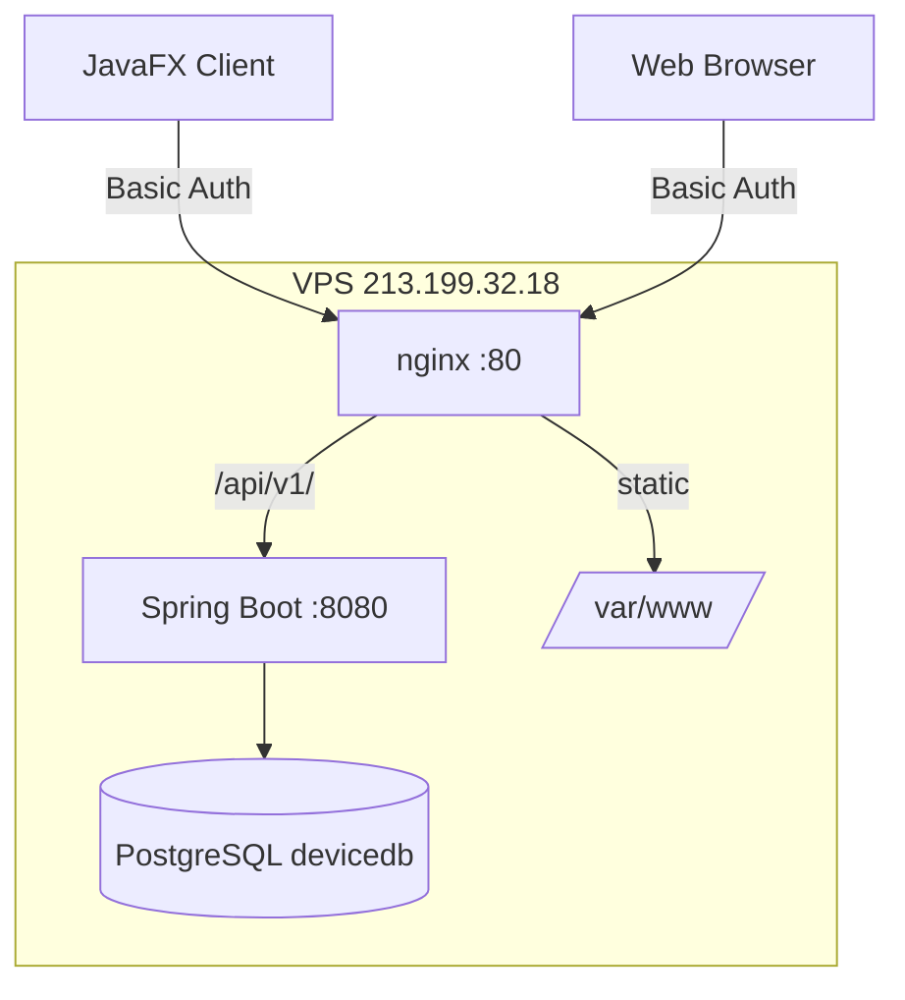
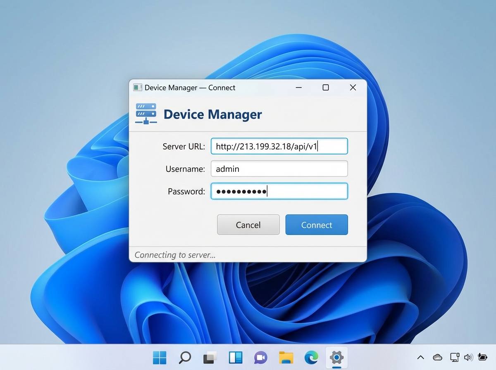
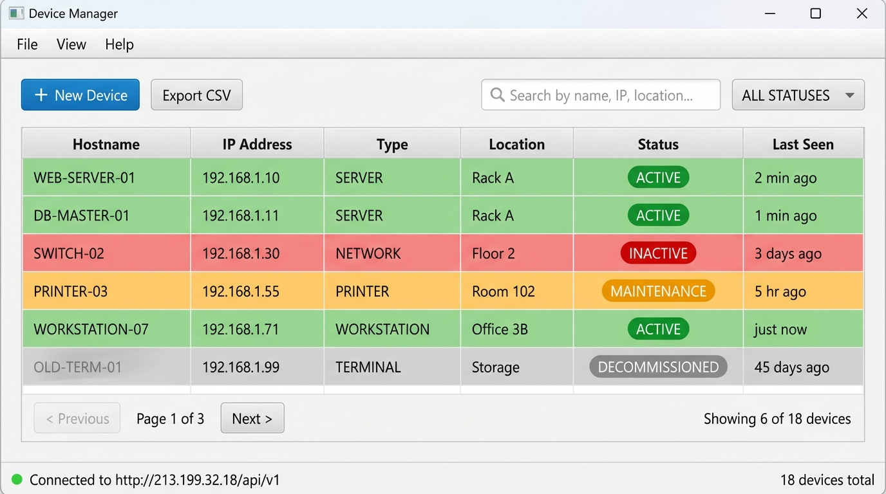

# Device Manager

[](https://github.com/mj-deving/device-manager/actions/workflows/ci.yml)


**Portfolio Project 2** — Spring Boot REST API + JavaFX Desktop Client for network device management.

Live API: `http://213.199.32.18/api/v1/devices` (Basic Auth required)

---

## Architecture

```
┌─────────────────────────────────────────────────────────────┐
│                     Client Machine                          │
│                                                             │
│  ┌──────────────────────┐    ┌─────────────────────────┐   │
│  │  JavaFX Desktop App  │    │  Web Browser (Project 3)│   │
│  │  (device-manager-    │    │  device-manager-web      │   │
│  │   client)            │    │                          │   │
│  └──────────┬───────────┘    └──────────┬───────────────┘   │
│             │ HTTP Basic Auth            │ HTTP Basic Auth   │
└─────────────┼────────────────────────────┼───────────────────┘
              │                            │
              ▼                            ▼
┌─────────────────────────────────────────────────────────────┐
│                   VPS · 213.199.32.18                       │
│                                                             │
│  ┌─────────────────────────────────────────────────────┐   │
│  │                 nginx (port 80)                      │   │
│  │  /api/v1/  ──────────────────────►  :8080           │   │
│  │  /health   ──────────────────────►  200 OK          │   │
│  │  /swagger-ui/  ─────────────────►  :8080            │   │
│  │  /  (static)  ──────────────────►  /var/www/        │   │
│  └─────────────────────┬───────────────────────────────┘   │
│                        │                                    │
│  ┌─────────────────────▼───────────────────────────────┐   │
│  │  Spring Boot 3.2 (device-manager-server · :8080)    │   │
│  │  Spring Security — Basic Auth (admin / admin123)    │   │
│  │  Spring Data JPA — Device CRUD + Logs + Stats       │   │
│  └─────────────────────┬───────────────────────────────┘   │
│                        │                                    │
│  ┌─────────────────────▼───────────────────────────────┐   │
│  │  PostgreSQL 16 (devicedb · :5432)                   │   │
│  │  Tables: devices, device_logs                       │   │
│  └─────────────────────────────────────────────────────┘   │
└─────────────────────────────────────────────────────────────┘
```

### Mermaid (rendered on GitHub)



---

## Modules

| Module | Description | Artifact |
|--------|-------------|----------|
| `device-manager-server` | Spring Boot REST API | Fat JAR (~45 MB) |
| `device-manager-client` | JavaFX desktop app | Shaded JAR + `mvn javafx:run` |

---

## API Reference

Base URL: `http://213.199.32.18`
Authentication: **HTTP Basic** — `Authorization: Basic base64(user:pass)`
Default credentials: `admin` / `admin123` _(portfolio demo only)_

### Devices — `/api/v1/devices`

| Method | Path | Description | Auth |
|--------|------|-------------|------|
| `GET` | `/api/v1/devices` | List devices (paginated, filterable) | ✓ |
| `GET` | `/api/v1/devices?status=ACTIVE` | Filter by status | ✓ |
| `GET` | `/api/v1/devices?type=ROUTER&q=rack` | Filter by type + search | ✓ |
| `GET` | `/api/v1/devices/{id}` | Get single device | ✓ |
| `POST` | `/api/v1/devices` | Create device | ✓ |
| `PUT` | `/api/v1/devices/{id}` | Replace device | ✓ |
| `PATCH` | `/api/v1/devices/{id}/status` | Update status only | ✓ |
| `DELETE` | `/api/v1/devices/{id}` | Delete device | ✓ |

### Logs & Stats

| Method | Path | Description | Auth |
|--------|------|-------------|------|
| `GET` | `/api/v1/devices/{id}/logs` | Audit log for a device | ✓ |
| `GET` | `/api/v1/stats` | Counts by status/type | ✓ |

### Public Endpoints

| Method | Path | Description |
|--------|------|-------------|
| `GET` | `/health` | Always 200 — nginx health check |
| `GET` | `/swagger-ui/` | Swagger UI (no auth required) |
| `GET` | `/v3/api-docs` | OpenAPI JSON spec |

### Query Parameters (`GET /api/v1/devices`)

| Param | Type | Example | Description |
|-------|------|---------|-------------|
| `status` | enum | `ACTIVE` | Filter: `ACTIVE`, `INACTIVE`, `MAINTENANCE`, `DECOMMISSIONED` |
| `type` | enum | `ROUTER` | Filter: `ROUTER`, `SWITCH`, `SERVER`, `WORKSTATION`, `PRINTER`, `OTHER` |
| `q` | string | `rack` | Search by name, IP, or location |
| `page` | int | `0` | Zero-based page index |
| `size` | int | `20` | Page size (default 20) |
| `sort` | string | `name,asc` | Sort field + direction |

### Example Requests

```bash
# List all devices (requires auth)
curl -u admin:admin123 http://213.199.32.18/api/v1/devices

# Create a device
curl -u admin:admin123 -X POST http://213.199.32.18/api/v1/devices \
  -H "Content-Type: application/json" \
  -d '{"name":"core-switch-01","type":"SWITCH","ipAddress":"10.0.0.1","location":"Rack A"}'

# Update status
curl -u admin:admin123 -X PATCH http://213.199.32.18/api/v1/devices/{id}/status \
  -H "Content-Type: application/json" \
  -d '{"status":"MAINTENANCE"}'

# Stats
curl -u admin:admin123 http://213.199.32.18/api/v1/stats
```

---

## JavaFX Client Features

| Feature | Description |
|---------|-------------|
| Login dialog | Validates credentials against live API before opening main window |
| Device table | Paginated list with name, type, status, IP, location columns |
| Search bar | Live filter by name, IP address, or location |
| Status filter | Dropdown: ALL / ACTIVE / INACTIVE / MAINTENANCE / DECOMMISSIONED |
| Color-coded status | Green=ACTIVE, Red=INACTIVE, Orange=MAINTENANCE, Gray=DECOMMISSIONED |
| Double-click detail | Opens edit/delete dialog for selected device |
| New device dialog | Form with validation |
| CSV export | Exports current (filtered) view to `.csv` |
| About dialog | Version info, API URL, build info |
| Offline banner | Red banner with Retry button when server unreachable |

---

## Screenshots

<table>
<tr>
<td align="center"><strong>Login Dialog</strong></td>
<td align="center"><strong>Main Window — Color-coded Device Table</strong></td>
</tr>
<tr>
<td></td>
<td></td>
</tr>
</table>

The login dialog connects to any REST API endpoint (defaults to the live VPS). The main window shows all devices with color-coded rows: **green** = ACTIVE, **red** = INACTIVE, **orange** = MAINTENANCE, **gray** = DECOMMISSIONED.

---

## Build & Run

### Prerequisites

- Java 17+
- Maven 3.9+
- PostgreSQL 16 (for local server only)

### Build All Modules

```bash
mvn clean package -DskipTests
```

### Run Server Locally

```bash
# 1. Create database and user (PostgreSQL must be running)
psql -U postgres -c "CREATE USER portfolio WITH PASSWORD 'portfolio_dev_password';"
psql -U postgres -c "CREATE DATABASE devicedb OWNER portfolio;"
psql -U portfolio -d devicedb -f device-manager-server/src/main/resources/db/schema.sql

# 2. Start server (dev profile: localhost:5432)
java -jar device-manager-server/target/device-manager-server-1.0.0.jar
# Or:
mvn spring-boot:run -pl device-manager-server
```

### Run JavaFX Client

```bash
# Against the live VPS (default)
mvn javafx:run -pl device-manager-client

# Against a local server
mvn javafx:run -pl device-manager-client -Dapi.baseUrl=http://localhost:8080
```

The login dialog will appear first. Enter `admin` / `admin123` (or your local credentials).

### Run Tests

```bash
# Server unit tests
mvn test -pl device-manager-server

# All tests
mvn test
```

---

## Project Structure

```
device-manager/
├── pom.xml                              ← parent POM (spring-boot-dependencies BOM)
├── .github/workflows/ci.yml            ← GitHub Actions CI (primary)
├── .gitlab-ci.yml                      ← GitLab CI (4-stage pipeline)
│
├── device-manager-server/
│   ├── pom.xml
│   └── src/main/java/com/mj/portfolio/
│       ├── config/
│       │   ├── CorsConfig.java
│       │   ├── OpenApiConfig.java
│       │   └── SecurityConfig.java      ← Spring Security: Basic Auth
│       ├── controller/
│       │   ├── DeviceController.java
│       │   ├── DeviceLogController.java
│       │   └── StatsController.java
│       ├── service/
│       ├── repository/
│       ├── entity/
│       ├── dto/
│       └── exception/
│
└── device-manager-client/
    ├── pom.xml
    └── src/main/java/com/mj/portfolio/client/
        ├── AppContext.java              ← shared ApiClient holder
        ├── DeviceManagerClientApp.java  ← login → main window flow
        ├── controller/
        │   ├── LoginController.java
        │   ├── MainController.java
        │   ├── DeviceDetailController.java
        │   └── DeviceFormController.java
        ├── service/
        │   ├── ApiClient.java           ← HTTP client with Basic Auth
        │   └── DeviceApiService.java
        └── model/
            ├── Device.java
            ├── DeviceStatus.java
            └── DeviceType.java
```

---

## CI/CD

### GitHub Actions (Primary — Active)

Runs on every push/PR to `master`:

1. Compile all modules
2. Apply DB schema + run server unit tests (JUnit 5, `@WebMvcTest`, `@WithMockUser`)
3. Compile client module
4. Package fat JARs → uploaded as downloadable artifacts (7-day retention)

### GitLab CI (Secondary — Requires account verification)

4-stage pipeline defined in `.gitlab-ci.yml`:

| Stage | Jobs | Description |
|-------|------|-------------|
| `build` | `build:server`, `build:client` | Compile both modules |
| `test` | `test:server` | JUnit 5 tests + JUnit report artifact |
| `package` | `package` | Fat JARs (master + tags only) |
| `deploy` | `deploy:server` | SSH to VPS: git pull + mvn package + restart service |

**To activate the deploy stage**, add these CI/CD Variables in GitLab:
- `SSH_PRIVATE_KEY` — ed25519 private key for VPS access (type: File, protected)
- `VPS_HOST` — `213.199.32.18`
- `VPS_USER` — `dev`

---

## Deployment

The server runs on the VPS behind nginx as a systemd service:

```bash
# SSH to VPS and deploy latest
ssh vps "cd /home/dev/device-manager && git pull origin master && \
  mvn clean package -pl device-manager-server -DskipTests -B && \
  bash /home/dev/deploy-app.sh device-manager \
  /home/dev/device-manager/device-manager-server/target/device-manager-server-1.0.0.jar"

# Monitor
ssh vps "sudo journalctl -u java-app@device-manager -f"

# Service control
ssh vps "sudo systemctl restart java-app@device-manager"
```

---

## ADRs

Architecture Decision Records are in [`.ai/decisions/`](.ai/decisions/):

- `001` — Multi-module Maven structure
- `002` — Spring Boot with custom parent POM (not `spring-boot-starter-parent`)
- `003` — GitHub Actions as primary CI (GitLab CI blocked on free tier)

---

*Part of a 4-project portfolio demonstrating Java full-stack development from CLI → REST API → Web UI → WebSocket.*
